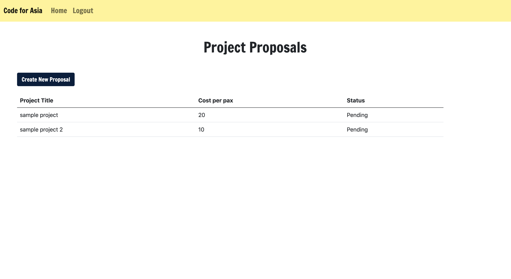

# Project Proposal 

You are a social enterprise headquartered in Singapore. Every year you run an online hackathon inviting youths from around ASEAN to submit their software prototypes for SDGs 4, 5, 8 or 11 via #codeathon. While the online challenge is going on, there are offline workshops/hackathons happening in different cities (pending local interest and resources) to support submission as well. From #codeathon, you select top few candidates for a 7-10 days CodeNomad bootcamp in an ASEAN/Chinese city. After the bootcamp, delegates are expected to go back to their own cities to either continue writing code for projects or to organise local learning events under your umbrella.  

## User Stories: 

* When I am logged in as a CodeNomad talent,I can complete a project proposal form (sample proposal) to apply for support from Code for Asia. 
* When I am logged in as an Admin, I can view the cost per pax for a project.

